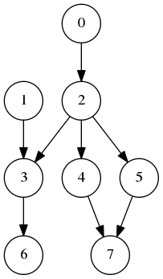

### Finding the order of process execuation via in-degree of vertices  




```
L = List (will  contain  topological  ordering)
S = List of nodes  with no  incoming  edges
while S is non -empty  do
    remove a node n from S
    add n to tail of L
    for  each  node m with an edge e from n to m do
        remove  edge e from  the  graph
        if m has no  other  incoming  edges  then
            insert m into S
      
if  graph  has  edges  then
    return  error (graph  has at  least  one  cycle)
else
    return L (a topologically  sorted  order)
```
##### Explaination
    1. Find a noden with no unsatisfied dependencies (incomingedges).
    2. “Compile” n and “remove” it from it’s dependents.
    3. If nodes have not been “compiled“ goto 1.  
